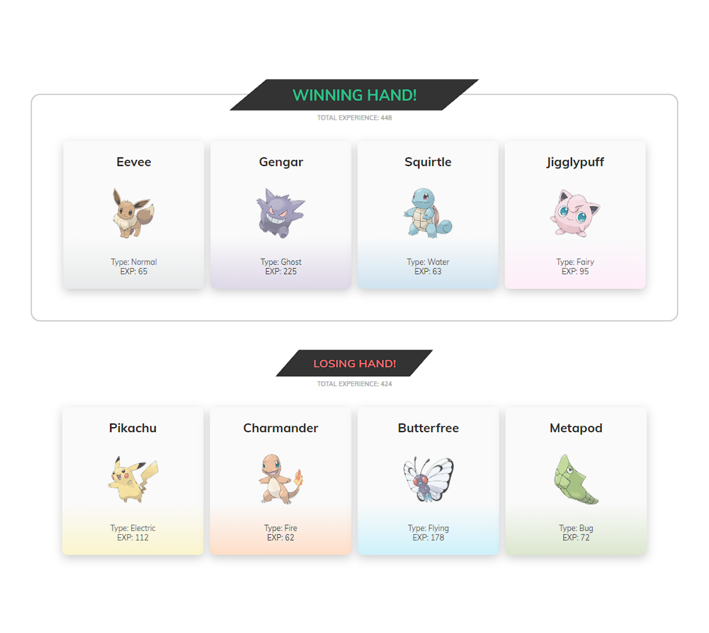

<!-- omit in toc -->
# Pokegame - The Modern React Bootcamp

<!-- omit in toc -->
## A battle between Two teams of four Pokemons

<!-- omit in toc -->
### Table of Contents

- [📃 About](#-about)
- [🛠️ Requirements](#️-requirements)
- [⚙️ Install](#️-install)
- [▶️ Run](#️-run)
- [🚀 Tools & Technologies](#-tools--technologies)
- [⚖️ License](#️-license)

## 📃 About

This project is part of a series of projects developed in Colt Steele's course - The Modern React Bootcamp. This is my iteration and it differs in the technologies I used and the styles I made.

In this game, two hands of "Pokecards" are drafted from a fake database with 8 pokemons. The hand with the highest total experience wins the round.

## 🛠️ Requirements

To run this application you need:

- [Git](https://git-scm.com/)
- [Node.js](https://nodejs.org/en/)
- [Yarn](https://yarnpkg.com/)

## ⚙️ Install

To install this project you just have to run the following commands in your terminal:

1. `git clone https://github.com/tiddal/pokegame.git`
2. `yarn`

## ▶️ Run

Run the command `yarn start` and have fun 😀

## 🚀 Tools & Technologies

- [HTML5](https://developer.mozilla.org/pt-PT/docs/Web/HTML/HTML5)
- [CSS3](https://www.w3schools.com/css/)
- [TypeScript](https://www.typescriptlang.org/)
- [React](https://reactjs.org/)
- [Node.js](https://nodejs.org/en/)
- **[Synxty CRA Template](https://www.npmjs.com/package/@synxty/cra-template-react-template)**
- [styled-components](https://styled-components.com/)

## ⚖️ License

This project is licensed under the MIT license. See [LICENSE](LICENSE) to learn more.

---

Thank you, made with 💗 by [tiddal](https://github.com/tiddal).
